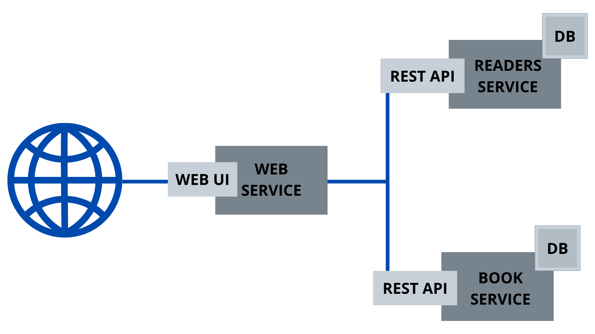

# Aplicação web em arquitetura de microserviço utilizando Docker 🐳

Esse artigo foi criado por conta da aula "Microserviço na prática - aplicação web PHP simples conectada via API Restful" apresentado no meu curso de Introdução a Docker! Curtiu?
[Eu quero o curso](http://bit.ly/cursoAprendaDockerdoZero)

### Se liga

- É preciso ter o Docker e o Compose instalado
- Testado e aprovado no Linux ❤️

### Como testar?

	git clone https://github.com/ricardoferreiracosta08/microservice-simple-docker-compose.git
	docker-compose up -d

Agora, manda ver 🤘

Qualquer contribuição é bem-vinda!

### Como funciona?

Tecnicamente, é uma aplicação web PHP em arquitetura de microserviço com containers Docker que se conecta 
via API Restful Flask com mapeamento objeto-relacional SQLAlchemy, escrito em Python, com persistência em banco de dados PostgreSQL.

Com 3 endpoints em cada API (books e readers):

/add (método POST)

	curl -X POST -H 'Content-Type: application/json' -d '{"name": "Python Book", "price": 400}' http://localhost:5000/add
	curl -X POST -H 'Content-Type: application/json' -d '{"name": "Ricardo"}' http://localhost:5001/add

/remove/<reader_id> (método DELETE)

	curl -X DELETE -H 'Content-Type: application/json' http://localhost:5000/remove/1
	curl -X DELETE -H 'Content-Type: application/json' http://localhost:5001/remove/1

/edit/<reader_id> (método PATCH)

	curl -X PATCH -H 'Content-Type: application/json' http://localhost:5000/remove/1 -d '{"name": "Python Book", "price": 400}'
	curl -X PATCH -H 'Content-Type: application/json' http://localhost:5001/remove/1 -d '{"name": "Fulano" }'

- Mais sobre o assunto no meu blog [AQUI](https://ricardoferreira.site/2020/11/aplicacao-web-microservico-docker-python-php/)
### Referências

Me basei nesse código: [Docker with SQLAlchemy](https://github.com/hmajid2301/articles/tree/master/8.%20Docker%20with%20SQLAlchemy) do 
[@hmajid2301](https://github.com/hmajid2301)
